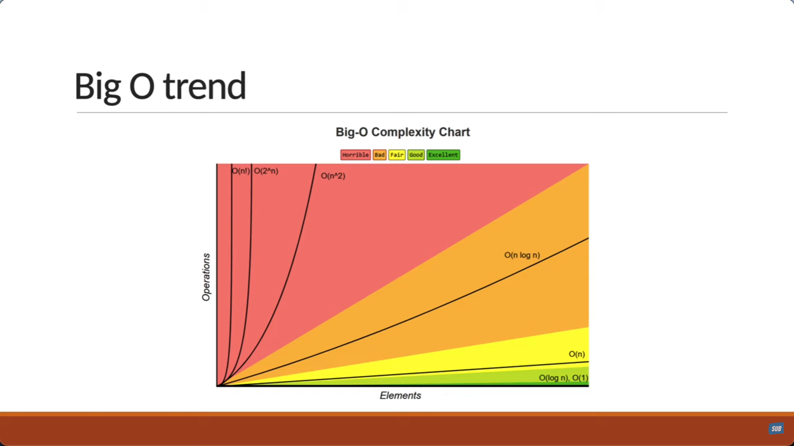

#### DS & A
### BIG-O TIME COMPLEXITY 

#### 1. Linear time complexity      - O(n) worst case time complexity/time complexity
#### 2. Constant time complexity    - O(1)
#### 3. Quadratic time complexity   - O(n^2)
#### 4. Cubic time complexity       - O(n^3)
#### 5. Logarithmic time complexity - O(logn)

##### BIG-O GUIDE

1. loop - O(n)
2. nested loop -O(n^2)
3. Logarithmic O(log n) input size reduced by half

##### SPACE COMPLEXITY
1. Constant - O(1) -no extra space/memory needed when input size increases
2. Linear   - O(n) - extra space neede when input size increases
3. Logarithmic -O(log n) - extra space needed grows but not at the same rate as the input size
4. Quadratic - you should try to avoid

